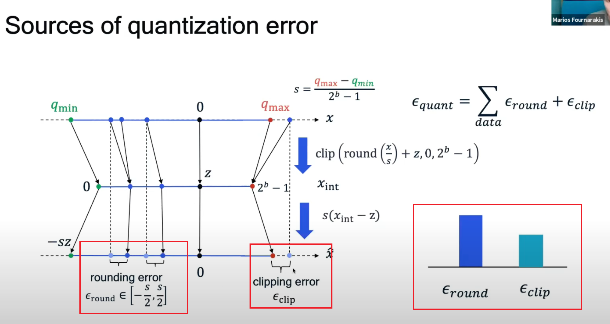

# quant expression

神经网络的量化的本质是将floating representation的数值表征换一种数值表征，以达到降低内存或者加速推理的作用。
线性量化是现在最常用的量化方式，他利用线性变换将浮点数映射到一定bit的整数范围，并且可以反变换到离散的浮点数表征。线性量化的参数计算：
$$
\begin{align}
scale = \frac{range(float)}{range(int)}
\end{align}
$$
scale是1 bit整数对应的浮点步长

量化表达式:

$$
\begin{align}
x_{rec} = clip(round(\frac {x}{scale}),dtype) * scale 
\end{align}
$$
$$
\begin{align}
x_{int} = clip(round(\frac {x}{scale}),dtype)
\end{align}
$$
其中就数值运算而言，线性量化的误差来自两个方面，一个是取整的rounding操作，另一个是截断的clip操作。

# rounding error
这里令 $ k = \frac{x}{scale} $, $ z = round(k) $ 这里有, 
$$
\begin{align}
k - \frac{1}{2} < z < k+\frac{1}{2}
\end{align}
$$
$$
\begin{align}
k * scale - \frac{1}{2} * scale < z * scale < k * scale+\frac{1}{2} * scale
\end{align}
$$
$$
\begin{align}
| k * scale - z * scale | = | x - x_{rec} |  = | \epsilon_{r } | < \frac{1}{2} * scale
\end{align}
$$
这里可以得出rounding引起的 量化前后的浮点误差和量化步长成正比，即scale减少scale可以减rounding带来的误差，当然这是在不考虑clipping操作的前提下，也就是我们假设校准数据足够准确，覆盖整个数据range。
其中

# clipping error
clipping指的是截断。量化之后能表示的浮点范围为：
$$
\begin{align}
Q_{max}(dtype) * scale 
\end{align}
$$
在这个范围之外的浮点数都将被截断，浮点表示的误差为：
$$
\begin{align}
| x - \hat{x} | = | x_{rec}^{max} - Q_{max}(dtype) * scale|
\end{align}
$$
scale越小，$x_{rec}^{max}$ 越小，能表示的浮点范围越小，原数据范围会被截断，因此clipping带来的误差也就会越大

# how to reduce quant error

